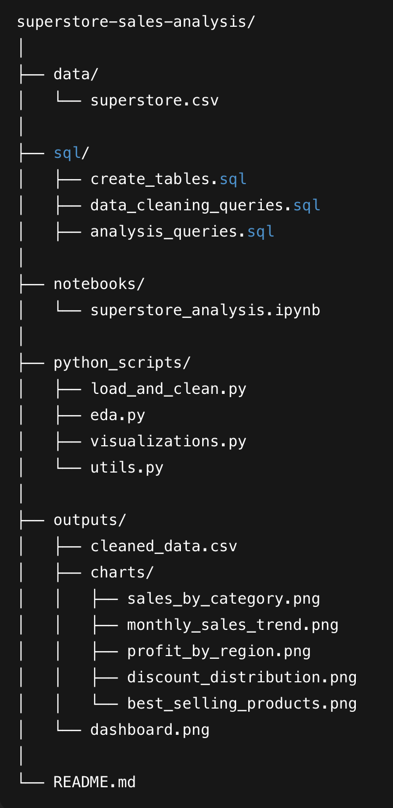

# Superstore Sales Analysis (Python + SQL Project)

## 1. Project Overview
This project performs end-to-end sales analysis of the Superstore dataset using:
- Python (Pandas, NumPy)
- SQL (MySQL Workbench)
- Matplotlib for visualizations

## 2. Project Structure

## 3. Key Steps
- Data cleaning
- Exploratory data analysis
- SQL analysis
- Data visualization
- Business insights

## 4. Visual Outputs
- Sales by Category
- Monthly Sales Trend
- Profit by Region
- Discount Distribution

## 5. Insights
# Business Insights  
### Key Findings:
- Technology category generates the highest sales.  
- West region is the most profitable.  
- Discounts above **0.3** reduce profit drastically.  
- Shipping delays average **3 days**.  
- A small number of products contribute to the majority of sales.  

---

### What the Business Should Do:
- Increase marketing on **Furniture** (low sales, moderate profit)  
- Reduce heavy discounts (hurts margins)  
- Improve shipping operations in regions with long delays  
- Promote top 10 best-selling products  
- Expand operations in **West** region  A

---

## 🛠 Tools Used
- Python (Pandas, NumPy, Matplotlib)
- MySQL Workbench
- Jupyter Notebook

## 👤 Author
Saikat Gayen
